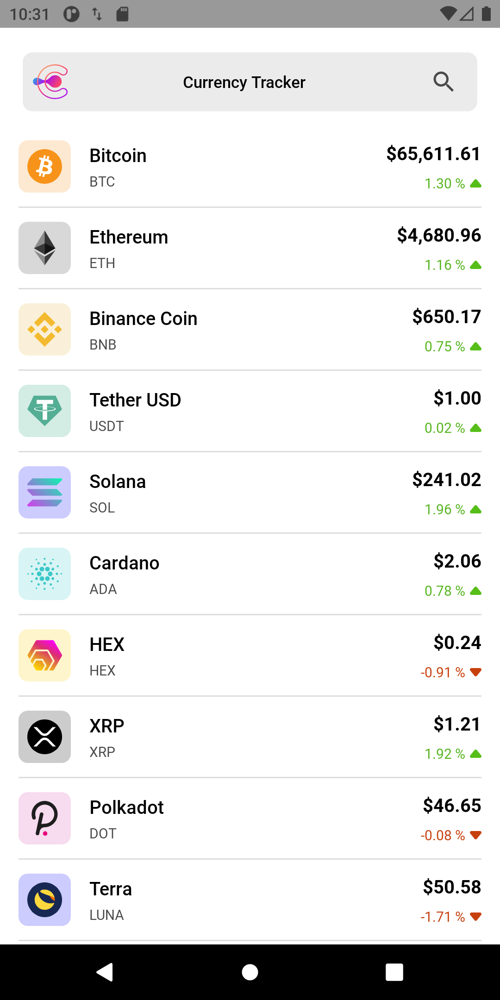
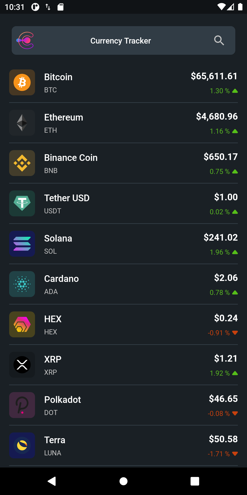
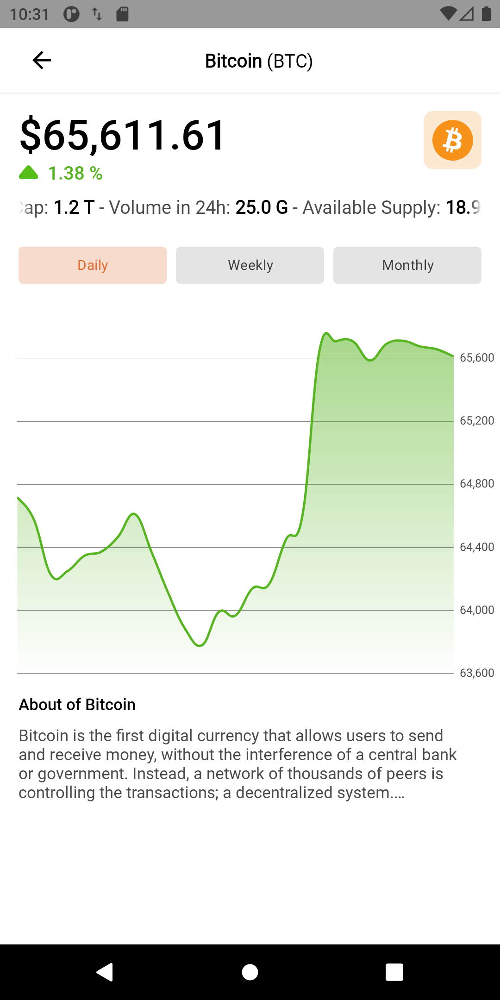
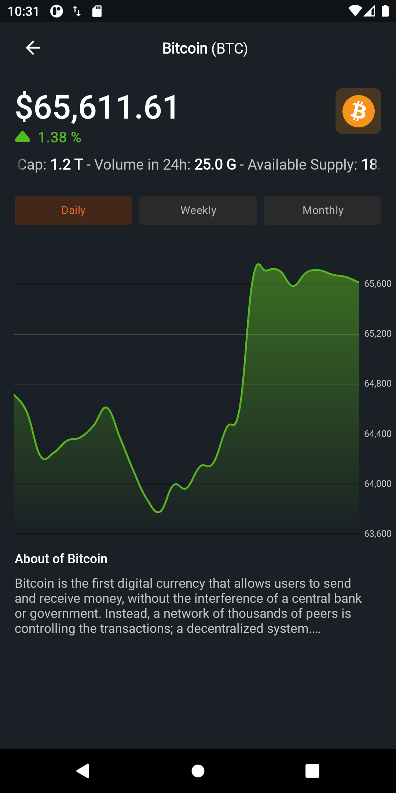

# Coin-Stalker
Coin Stalker App is an android application that displays current crypto currency rates based on modern Android application tech-stacks and MVVM architecture.

# Tech stacks
- Completely [Kotlin](https://kotlinlang.org/) based 
- [Coroutines](https://github.com/Kotlin/kotlinx.coroutines) + [Flow](https://kotlin.github.io/kotlinx.coroutines/kotlinx-coroutines-core/kotlinx.coroutines.flow/) for asynchronous operations
- [Hilt](https://dagger.dev/hilt/) for dependency injection
- [MVVM Architecture](https://developer.android.com/jetpack/guide) is modern and google recommended architecture
- [Retrofit2 & OkHttp3](https://github.com/square/retrofit) for networking operations
- [Moshi](https://github.com/square/moshi/) a modern JSON library
- [MpChart](https://github.com/PhilJay/MPAndroidChart) a powerful & easy to use chart library for Android 
- [Glide](https://github.com/bumptech/glide) for loading images
- [Shimmer](https://github.com/facebook/shimmer-android) for shimmer effect loading screens
- [JUnit5](https://junit.org/junit5/docs/current/user-guide/) a unit test framework
- [Truth](https://truth.dev) for performing assertions in tests
- [Mockk](https://mockk.io) for mock objects in tests
- Modular Structure(app, core, data, domain)
- Dependency Management Using buildSrc + Kotlin DSL

# Plugins
- [Ktlint](https://github.com/JLLeitschuh/ktlint-gradle) an anti-bikeshedding Kotlin linter with built-in formatter
- [Detekt](https://detekt.github.io/detekt/gradle.html) a static code analysis tool for the Kotlin programming language.
- [Version Check](https://github.com/ben-manes/gradle-versions-plugin) provides a task to determine which dependencies have updates.

# Screenshot
| Page  | Light Mode                                        | Dark Mode |
|-------|---------------------------------------------------|------------------------------------------|
| Home |  | |
| Detail |  | |

# Others
- App logo from [Freepik](https://www.freepik.com/free-vector/gradient-c-logo-template-collection_13403316.htm#page=1&query=c%20logo&position=0&from_view=search)
- Error page image from [Freepik](https://www.freepik.com/free-vector/feeling-sorry-concept-illustration_10117948.htm#page=1&query=feeling%20sorry&position=0&from_view=search)
- Powered by [CoinRanking](https://developers.coinranking.com)
